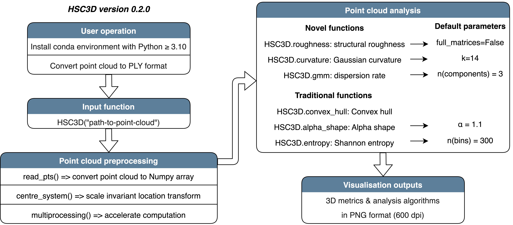

# HSC3D

HSC3D: a Python package to quantify three-dimensional habitat structural complexity

## Package workflow



## Setup environment

Install Anaconda or miniconda to your device. See more information at [this link](https://docs.conda.io/projects/conda/en/latest/user-guide/install/download.html).

```
# choose your own virtual environment name
conda create -n hsc3d_test python=3.10 -y

conda activate hsc3d_test
```

## Installation

``pip install HSC3D``

## Usage

See [sample_usage.ipynb](sample_usage.ipynb) for a quick start.

## Demo case study point cloud data

[](http://www.youtube.com/watch?v=ZSOoDtyBH94)

## Citation

Please cite the following paper if you use HSC3D in your research:

```
Gu, Y.-F., Hu, J., Han, K., Lau, J. W. T., & Williams, G. A. (2024).
HSC3D: A Python package to quantify three-dimensional habitat structural complexity.
Methods in Ecology and Evolution, 00, 1–8.
https://doi.org/10.1111/2041-210X.14305
```

## License

Creative Commons Attribution-NonCommercial [License](https://creativecommons.org/licenses/by-nc/4.0/)
